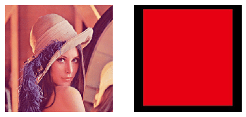
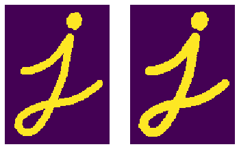

# Start The Application
**By Runing `app.py file`**
# Addition And Subtraction Operations
* **Two 256x256 Images ( Image(1) & Image(2) )**

* **Image(1) + Image(2) With Alpha = 0.90**

* **Image(1) - Image(2) with Alpha = 0.85**

# Image Dilation Examples With Difference Selements

* **Selement = [[1,1,1][1,1,1][1,1,1]]**

* **Selement = [[0,1,0],[1,1,1],[0,1,0]]**

